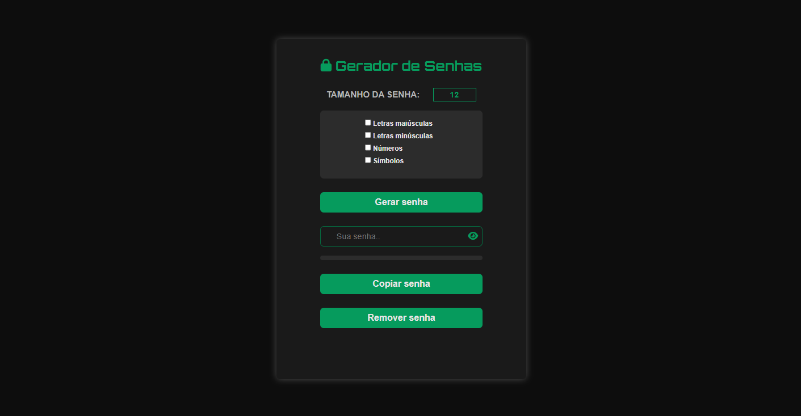

# 🔐 Gerador de Senhas Seguras

Um gerador de senhas seguras, personalizável e fácil de usar, feito com HTML, CSS e JavaScript. Ideal para criar senhas fortes com diferentes combinações de caracteres.

## 📸 Prévia

 

## 🚀 Funcionalidades

- Definição do tamanho da senha (entre 4 e 50 caracteres)
- Inclusão de:
  - Letras maiúsculas
  - Letras minúsculas
  - Números
  - Símbolos
- Botão para:
  - Gerar a senha
  - Copiar a senha
  - Remover a senha
- Visualização da senha gerada com botão para mostrar/ocultar
- Barra indicadora de força da senha (se implementada no JS)

## 🛠 Tecnologias utilizadas

- HTML5
- CSS3
- JavaScript
- [Font Awesome](https://fontawesome.com/) para ícones

Desenvolvido com 💻 por Pedro Souza

